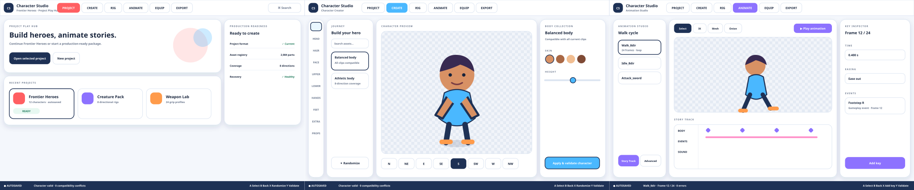

# Paper Quest Character Studio

> A Godot desktop studio for turning modular 2D art into animated, game-ready characters.

**Status:** active development (0.1.0-dev) · **Engine:** Godot 4.7.1 · **Target:** Windows desktop



*Design overview of the Project hub, Character Creator, and Animation Studio.*

Paper Quest Character Studio is an import-first authoring application for 2D
characters. Bring in modular artwork, assemble it into a character, rig and
pose it, animate it, validate the result, and package it for a game. It keeps
skeletal and pixel-safe workflows in the same project and includes a reusable
Godot runtime addon for consuming exported character data.

## What it can do

| Workspace | Capabilities |
| --- | --- |
| **Project & Assets** | Create, open, duplicate, archive, repair, and recover projects; browse compatible parts and inspect project health. |
| **Create** | Import PNG, WebP, and JPEG layers from files, folders, or drag-and-drop; map names such as head, body, hair, and hands to slots; transform, tint, reorder, hide, lock, solo, duplicate, replace, or remove layers. |
| **Rig** | Build bone hierarchies, author poses, use constraints and IK, retarget compatible poses, and work with mesh/deformation data. |
| **Animate** | Create layered clips with keyframes, composition, timing controls, curves, onion controls, image swaps, and facing-aware animation. |
| **Weapon & Equipment** | Author equipment poses, grips, action points, and weapon behavior with solver support. |
| **Preview & Export** | Validate projects, batch-export deliverables, make review packages, and produce runtime packages for downstream game use. |
| **Safety & recovery** | Use document-level undo/redo across workspaces, autosave, crash recovery, dated backups, missing-file repair, and deterministic versioned project data. |

## A character workflow, end to end

1. **Start a project** from the hub, continue recent work, or open a read-only sample.
2. **Import art** and assemble it into named character slots in Create.
3. **Rig and pose** the assembled layers with bones, constraints, IK, and deformation tools.
4. **Animate** layered clips, tune timing, and preview directional behavior.
5. **Add equipment** with reusable grips, action points, and weapon-specific poses.
6. **Validate and deliver** the character through exports, review packages, or the runtime addon.

> **Current art model:** Paper Quest does not generate character artwork. It
> starts with art you import and keeps your source layers editable.

## Run locally

1. Install **Godot 4.7.1**.
2. Clone this repository and open [project.godot](project.godot) in Godot's
   Project Manager, or start it from a terminal:

~~~powershell
git clone https://github.com/DocDamage/2d-character-creator-and-animator.git
cd 2d-character-creator-and-animator
godot --editor --path .
~~~

3. Run the project from Godot (F5). The startup flow leads to a new project,
   an existing project, or a sample, then opens the appropriate workspace.

### Headless tools

The repository also includes a production CLI and a Godot-based test runner:

~~~powershell
# Show validation, import, review-package, asset-pack, and runtime-export commands
godot --headless --path . --scene res://tools/studio_cli.tscn -- help

# Run the project test suite
godot --headless --path . --scene res://tests/test_runner.tscn
~~~

See [Production delivery workflows](docs/guides/PRODUCTION_DELIVERY_WORKFLOWS.md)
for CLI examples, review packages, asset packs, and runtime export contracts.

## Built for production work

- **Portable projects:** versioned JSON project files, relative asset paths,
  deterministic serialization, transactional saves, and rolling backups.
- **Two compatible animation paths:** a modular skeletal pipeline with bones,
  weights, meshes, and smooth interpolation; and a pixel-safe pipeline with
  layered frames, integer snapping, discrete angles, and nearest-neighbor
  treatment.
- **Runtime handoff:** the independent
  [runtime_plugin](runtime_plugin) reconstructs animation, skeleton, mesh,
  facing-grid, event, equipment, and grip data without depending on editor UI.
- **Windows distribution:** release tooling supports portable EXE+PCK ZIPs,
  embedded-PCK builds, manifests/checksums, and an NSIS installer template.
- **Quality-minded authoring:** imported artwork can be audited for blank
  layers, duplicates, oversized files, changed-on-disk content, and optional
  provenance before it becomes part of a portable project.

## Repository guide

| Path | Purpose |
| --- | --- |
| [app](app) | Application startup, workspace shell, commands, and shared Paper Quest UI. |
| [character](character), [rigging](rigging), [animation](animation), [deformation](deformation) | Core character, pose, animation, and deformation domains. |
| [weapons](weapons), [facing](facing), [gameplay_metadata](gameplay_metadata) | Equipment, directional behavior, and game-facing character data. |
| [export](export), [runtime_plugin](runtime_plugin), [production](production) | Delivery formats, runtime integration, and production automation. |
| [tests](tests) | Unit, integration, round-trip, visual, stress, and fixture-based verification. |
| [docs](docs) | User, build, architecture, delivery, licensing, and verification documentation. |
| [design/character-studio](design/character-studio) | Tokens, component manifest, interactive prototype, and visual implementation handoff. |

## Direct-start LPC creation

Phases 0–2 of the dedicated **direct-start LPC creator** are implemented.
On a normal desktop launch, the LPC chooser lets a creator locate a locked
local source library, rebuild its deterministic catalog, choose a license
policy and compatible body family, create a project, or resume the latest
editable LPC project. **Open Advanced Studio** remains available when the LPC
library is absent or a non-LPC workflow is needed.

The repository intentionally does not bundle upstream LPC art. A local source
library needs its own `lpc_source.lock.json` and `lpc_catalog_source.json`;
the app validates source hashes, image metadata, layouts, credits, aliases,
and policy eligibility before a project can be created. The tracked
[`lpc/lpc_source.lock.json`](lpc/lpc_source.lock.json) documents the pinned
adapter contract, not a redistributed art pack.

The implemented foundation also includes deterministic catalog caching and
diffs, exact alternative-license selection and credit manifests, versioned
sheet layouts/frame references, a strict CPU triangle raster reference path,
LPC project migrations/backups/autosave/recovery, and staged virtualized
catalog queries. The focused three-column LPC Creator now assembles compatible
body/features and equipment layers, shows capability badges and explicit
missing-animation conflicts, plays verified native four-direction clips, and
exports exact PNG frame sequences with render-snapshot and credit manifests.

Read the complete
[Direct-Start LPC Creator plan](DIRECT_START_LPC_CREATOR_PLAN.md) for scope,
asset handling, licensing, animation, pixel editing, deformation, and export
details.

Run the focused phase-0/1 acceptance check with:

```powershell
godot --headless --path . --scene tests/lpc_phase01_runner.tscn
godot --headless --path . --scene tests/lpc_phase2_runner.tscn
```

## Documentation

- [User guide](docs/guides/USER_GUIDE.md) — day-to-day project, import, layer,
  recovery, and workspace use.
- [Architecture overview](docs/architecture/ARCHITECTURE_OVERVIEW.md) —
  services, project format, dual-pipeline model, runtime addon, and tests.
- [Production delivery workflows](docs/guides/PRODUCTION_DELIVERY_WORKFLOWS.md)
  — batch, review, runtime, asset-pack, and CLI delivery flows.
- [Release build guide](docs/guides/RELEASE_BUILD_GUIDE.md) — Windows packaging,
  verification, signing, and update manifests.
- [Known issues](release/KNOWN_ISSUES.md) — remaining release QA constraints.
- [Asset license manifest](docs/architecture/ASSET_LICENSES.md) — required
  provenance and licensing practices for distributed content.
- [Character Studio UI design package](design/character-studio/README.md) —
  visual direction, implementation mapping, and Figma handoff materials.

## Artwork and licensing

Character artwork remains the creator's responsibility. The project tracks
asset source, author, and license requirements so samples and shipped content
can be audited before release. The planned LPC library is intentionally kept
local and out of Git until each included asset's distribution terms and credits
are verified. See the [asset license manifest](docs/architecture/ASSET_LICENSES.md)
before adding or shipping third-party art.
